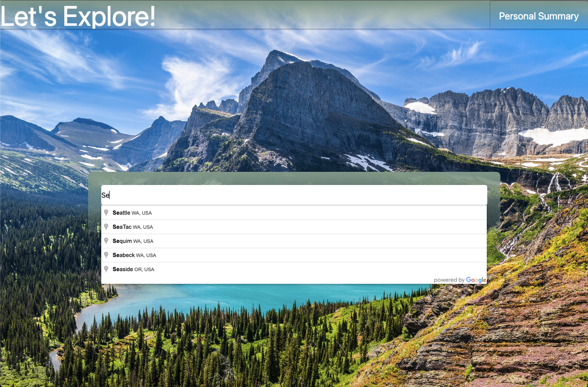
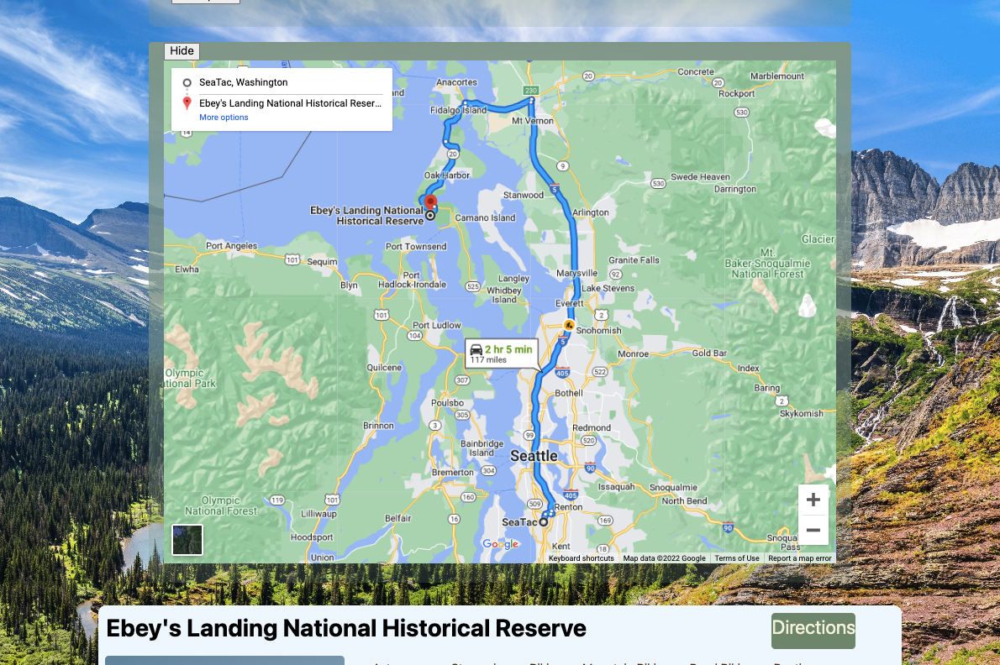
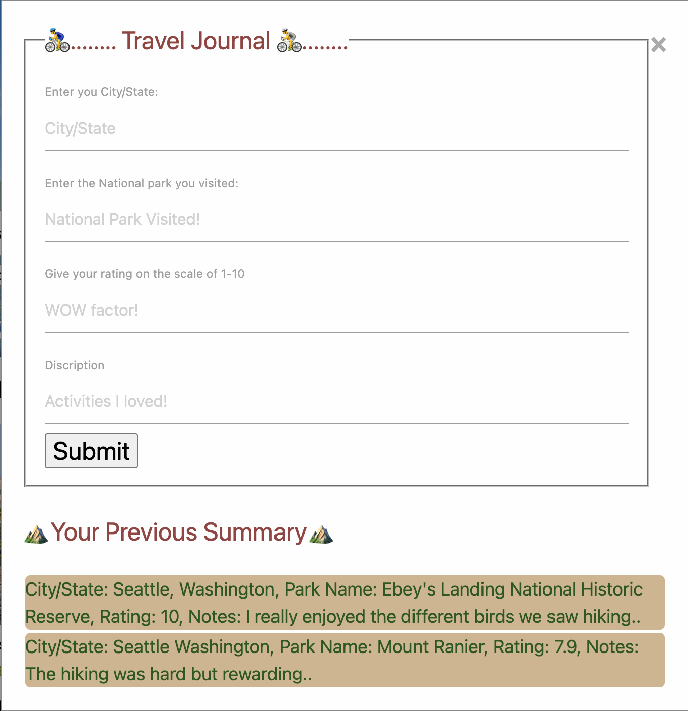

# hiking-app

## Project Description
The [Explore Home](https://mattdack.github.io/hiking-app) allows users to search a valid city name to be provided with a list of national parks in their state. For each park, we provide a list of activities that are available there, directions to get there, and the weather at their initial search location. The site utilizes the google maps places api to autocomplete and generate valid city names as well as directions to selected national park. The openweathermap geo and data api is used to obtain the latitude and longitude of the initial location and weather data there. We also utilize the national park service api to provide a list of national parks and activities. Event tracking enables the initial search and direction buttons. Javascript dynamically updates the page with new weather data, national parks, and directions based on user interaction. The site is responsive to different view port sizes. Lastly, user journal entries are currently stored locally.

## Deployed Application Link 
The website is deployed [here](https://mattdack.github.io/hiking-app).

## Screenshots

## Usage 

Enter a valid city name in the location element and select search to load all of the national parks in your state. On the cards for each national park you can select the title to be taken to the national park website. Select Directions for directions from your city to the national park. You may select more options in the map to enter a more specific address. Select the personal summary in the navigation bar to be taken to a journal of past national park experiences. Complete the form and select submit to begin storing ratings and data locally on your device.

## Credits

 Matthew Dacanay, Shreya Mishra, and Liyuan Zhao contributed equally and created the entirety of this webpage. Matthew focused on the landing page structure and styling, google maps places autocomplete and direction APIs. Shreya focused on the national park service API and personal summary pop-up. Liyuan focused on styling the returned NPS data, openweathermap geo and data APIs, and local storage of personal summary. Technical concepts and public resources were referred to as needed. You can find other projects by Matthew, Shreya, and Liyuan at each of their github pages: [Matthew](https://github.com/mattdack), [Shreya](https://github.com/shreyamishra9618), [Liyuan](https://github.com/LiyuanSilviaZhao).